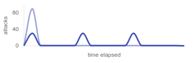
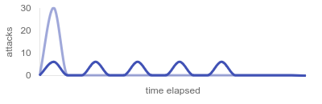
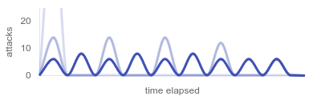

<script src="https://cdn.jsdelivr.net/npm/asciinema-player@3.5.0/dist/bundle/asciinema-player.min.js"></script>
<link rel="stylesheet" href="https://cdn.jsdelivr.net/npm/asciinema-player@3.5.0/dist/bundle/asciinema-player.min.css">

## Decorator and structure

After [registering exploit directories](./setup.md#register-exploit-directories), you also need to register each exploit function by placing the `@exploit` decorator above it. Exploit functions and their files can have any custom name. It's a common practice to have a single file per exploit. You can freely add, remove, and modify exploits while Avala is running without restarting, since it scans and reloads all new and existing exploits at the beginning of each tick.

---

The following example shows a simple exploit with minimal configuration. Notice that the logic of the exploit function is focused on exploiting a single service instance.

```py hl_lines="4"
from avala import exploit


@exploit(service="wish")
def attack(target: str):
    return requests.get(f"http://{target}:5000/flag").text
```

`@exploit` decorator must be above your exploit function definition, with the `service` parameter set to the name of the service you are attacking. Run `avl services` to view valid service names (as listed in flag IDs).

Your exploit function must accept `target` parameter, and optionally `flag_ids` and `store` parameters described below. During each attack, the value of the `target` parameter will be one of the opponent teams' IP addresses.

When obtaining the flag, you don't need to match or extract it as it will be done automatically by Avala. You can return **any** object that, when converted to a string, contains one or multiple flags.

!!! tip

    Flags are extracted by regex pattern configured in server settings. Make sure that the flag is not encoded or altered (e.g. URL encoded, escaped...) when you return it. Remember to reverse such encodings.

## Running exploits

Avala runs exploits at the beginning of each tick, which is suitable for attacking throughout the game but it's not development-friendly. When it comes to manually running and testing exploits during development, `avl` command comes in handy.

To run an exploit immediately, run `avl launch [exploit alias]`. To list registered exploits, run `avl exploits`.

By default, alias of your exploit will be `<module name>.<function name>`, but you can set it to a custom value using `alias` field of the `@exploit` decorator. You can also exclude your exploit from being picked up by Avala in production mode by setting `draft` to `True` in the `@exploit` decorator.

```py hl_lines="3 4"
@exploit(
    service="history",
    alias="history_1",
    draft=True,
)
def attack(target: str):
    ...
```

<div id="launch-2-demo"></div>
<script>
  AsciinemaPlayer.create('/avala/assets/demos/launch.cast', document.getElementById('launch-2-demo'), {
      cols: 126,
      rows: 28,
      idleTimeLimit: 2
  });
</script>

For all exploit settings, refer to [decorator reference](./decorator.md). 

For using the CLI, refer to [CLI reference](./cli.md). 

## `target` parameter

Before each attack, the `target` parameter will be populated by one of the opponent teams' IP addresses. Avala will execute one attack (or more if using `flag_ids`) for each available IP address.

### Choosing targets

By default, Avala will run attacks against all available targets at the same time. You can narrow down the targets by specifying a list of IP addresses using the `targets` parameter of the `@exploit` decorator. This is useful during developing and testing your exploit.

```py hl_lines="3"
@exploit(
    service="wish",
    targets=["10.10.19.1", "10.10.20.1", "10.10.21.1"],
)
def attack(target: str):
    return requests.get(f"http://{target}:5000/flag").text
```

You can also use a `TargetingStrategy` instead of specifying a list of hosts:

- `TargetingStrategy.AUTO` **(default)** – Selects all available hosts, excluding your own team and the NOP team.
- `TargetingStrategy.NOP_TEAM` – Selects the hosts of the NOP team.
- `TargetingStrategy.OWN_TEAM` – Selects the hosts of your own team.

If you want to attack all hosts except some (e.g. the teams that patched the vulnerability), you can exclude them using `skip` parameter.

```py hl_lines="3"
@exploit(
    service="wish",
    skip=["10.10.13.1", "10.10.37.1"],
)
def attack(target: str):
    return requests.get(f"http://{target}:5000/flag").text
```

For all exploit settings, refer to [decorator reference](./decorator.md).

## `flag_ids` parameter

In addition to the target IP, Avala will also provide the corresponding flag ID value for the given service, target and tick. To start using flag ID values to assist your attacks, just add `flag_ids` parameter to your exploit function.

```py hl_lines="2"
@exploit(service="wish")
def attack(target: str, flag_ids: str):
    return requests.get(f"http://{target}:8000/flag?password={flag_ids}").text
```

If flag ID values for the last 5 ticks are provided, Avala will run 5 concurrent attacks against that target, using the flag ID value from each tick. If you have Redis in your setup, Avala will cache flag IDs from successful attacks so the same attacks don't run twice.

!!! note

    `flag_ids` can be of any type, depending on what is being returned from the game server. Common formats include plain strings, dictionaries, stringified JSON objects, etc.

### Adjusting flag ID scope

Flag IDs are usually provided by the game server for a few latest ticks. By default, Avala will run an attack for each tick, meaning that the `flag_ids` parameter will contain just a single flag ID entry.

If you prefer, you can change the scope of the `flag_ids` parameter so it will contain a list of all provided flag IDs for the given service and target.

```py hl_lines="3"
@exploit(
    service="wish",
    flag_id_scope=FlagIdScope.LAST_N_TICKS,
)
def attack(target: str, flag_ids: list[str]):
    responses = []
    for password in flag_ids:
        responses.append(requests.get(f"http://{target}:5000/flag?password={password}").text)
   
   return responses
```

!!! tip
    
    This strategy can reduce the number of attacks since it uses all available flag ID values at once, but the recommended way is to use the default setting instead, paired with Redis cache for caching successful attack attempts. Caching only works with the default `flag_id_scope` setting, and it will make Avala skip all sucessful attacks (tracked by the hash of the exploit alias and flag ID value).

For all exploit settings, refer to [decorator reference](./decorator.md).

## Distributing attacks over time

Running a large number of attacks at the same time can cause spikes in CPU, memory and network usage, which is why Avala provides a way to distribute the attacks evenly and utilize the tick time effectively.

### Optimizing with delays

When running multiple exploits, Avala offers the `delay` parameter for delaying the beginning of the attacks.

The following example assumes that there are 30 targets. Running all three exploits at once would result in up to 90 attacks running at the same time.

```py
@exploit(service="wish")
def alpha(target: str):
    pass


@exploit(service="pay", delay=5)
def bravo(target: str):
    pass


@exploit(service="own", delay=10)
def charlie(target: str):
    pass
```



With the delays configured, at the beginning of each tick Avala will run the exploit `alpha` against 30 targets, 5 seconds later it will run `bravo`, and another 5 seconds later it will run `charlie`. Assuming that none of these exploits takes more than 5 seconds (exploits typically take much less), the peak number of running attacks will be no more than 30, rather than up to 90.

### Optimizing with batching

`batching` attribute allows you to divide the list of targets into smaller, equally-sized, and more manageable batches. This will distribute the load over time and mitigate any CPU, memory and network usage spikes.

Configuring batching includes setting `count` for number of batches or `size` for batch size, and `interval` in seconds. 

In case of **28** targets and `count` set to **5**, the sizes of batches will be: **6, 6, 6, 6, 4**.

```py
Batching(count=5, interval=2)
```

In case of **28** targets and `size` set to **5**, the sizes of batches will be: **5, 5, 5, 5, 5, 3**.

```py
Batching(size=5, interval=2)
```

The following example assumes that there are 30 targets. Running the exploit without batching would result in up to 30 attacks running at the same time.

```py hl_lines="3"
@exploit(
    service="pay",
    batching=Batching(count=5, interval=2)
)
def alpha(target: str):
    pass
```



With batching configured, at the beginning of each tick Avala will run the exploit on the first batch of targets, then wait for 2 seconds before running the next batch, repeating until it's done with all the targets. Assuming that none of these exploits takes more than 2 seconds (exploits typically take much less), the peak number of running attacks will be no more than 6, rather than up to 30.

If you are using batching on multiple exploits, set **different delays** for each exploit to prevent the batches from overlapping. This will eliminate any "stacked spikes" you may create from batching.



## `store` parameter

